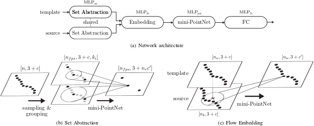

# DeepCLR: Correspondence-Less Architecture for Deep End-to-End Point Cloud Registration

This work addresses the problem of point cloud registration using deep neural networks.
We propose an approach to predict the alignment between two point clouds with overlapping data content, but displaced origins.
Such point clouds originate, for example, from consecutive measurements of a LiDAR mounted on a moving platform.
The main difficulty in deep registration of raw point clouds is the fusion of template and source point cloud.
Our proposed architecture applies flow embedding to tackle this problem, which generates features that describe the motion of each template point.
These features are then used to predict the alignment in an end-to-end fashion without extracting explicit point correspondences between both input clouds.
We rely on the KITTI odometry and ModelNet40 datasets for evaluating our method on various point distributions.
Our approach achieves state-of-the-art accuracy and the lowest run-time of the compared methods.

Authors: [Markus Horn](mailto:markus.horn@uni-ulm.de), [Nico Engel](mailto:nico.engel@uni-ulm.de), [Vasileios Belagiannis](mailto:vasileios.belagiannis@uni-ulm.de), [Michael Buchholz](mailto:michael.buchholz@uni-ulm.de), [Klaus Dietmayer](mailto:klaus.dietmayer@uni-ulm.de)  
ArXiv: https://arxiv.org/abs/2007.11255

```
@inproceedings{horn2020deepclr,
    author={Horn, Markus and Engel, Nico and Belagiannis, Vasileios and Buchholz, Michael and Dietmayer, Klaus},
    booktitle={IEEE 23rd International Conference on Intelligent Transportation Systems (ITSC)},
    title={DeepCLR: Correspondence-Less Architecture for Deep End-to-End Point Cloud Registration},
    year={2020},
    pages={1--7},
    doi={10.1109/ITSC45102.2020.9294279}
}
```

For questions or support please email [Markus Horn](mailto:markus.horn@uni-ulm.de).


## Table of Contents

[[_TOC_]]


## Network Architecture




## Installation

### Docker

The recommended way for using DeepCLR is from within a Docker container.
We provide two images: a full image with all dependencies and DeepCLR installed `deepclr` and an image with dependencies only `deepclr-deps`.
Only the NVIDIA drivers, Docker (https://docs.docker.com/get-docker/), and nvidia-docker (https://github.com/NVIDIA/nvidia-docker) have to be installed on your host system for using these images.

The `docker/run_docker.sh` script starts a new container in interactive mode, using your current user within the container and forwarding all required environment variables.
You can use your current user and mount your home directory with the `--user` option or mount other directories with `-m DIR`.
Further options are printed with `./docker/run_docker.sh --help`.

If you want to pull and launch the full image, simply use
```bash
./docker/run_docker.sh --user -m /datasets
```

In case you want to use the sources from the repository and load the image with only dependencies, add the `--deps` option.
In this case, the script automatically prepends the DeepCLR directory to your `PYTHONPATH` within the container.

Alternatively, you can also build the images locally using `docker/build_docker.sh` and run the containers using `docker/run_docker.sh` with the `--local` option.

Since our GPU cluster runs on singularity, we also provide `docker/docker2singularity.sh` for converting a docker image to a singularity image and `docker/python_singularity.sh` for running python scripts within a singularity container.


### Local
Call the following commands from the root directory of this repository to install DeepCLR along with all necessary dependencies.
We recommend using a `virtualenv` for this.

We assume that CUDA 11.1 is already installed.
The dependencies `torch`, `torchvision` and `torch-cluster` are installed for this specific version.
If you are using another CUDA version, you can change this according to the documentation at https://pytorch.org/ and https://github.com/rusty1s/pytorch_cluster.

```bash
# System requirements
sudo apt update
sudo apt install build-essential cmake ghostscript gnuplot libcap-dev libglib2.0-0 libgl1-mesa-glx libusb-1.0-0 libgsl-dev texlive-extra-utils unzip

# (Optional) Create and source virtual environment
python -m venv venv
source venv/bin/activate

# Wheel
python -m pip install wheel

# (Optional) Python dependencies for specific CUDA version
python -m pip install torch==1.8.1+cu111 torchvision==0.9.1+cu111 -f https://download.pytorch.org/whl/torch_stable.html
python -m pip install torch-cluster==1.5.9 -f https://pytorch-geometric.com/whl/torch-1.8.0+cu111.html

# Python dependencies
python -m pip install -r requirements.txt

# Prepare, build and install external dependencies
./extern/prepare.sh
./extern/install.sh

# Install DeepCLR in editable mode
python -m pip install -e .
```


### TensorBoard
The script `docker/run_tensorboard.sh` starts TensorBoard within a separate Docker container and forwards all arguments.

```bash
./docker/run_tensorboard.sh ~/models --port 16006
```


## Datasets and Environment Variables

Since we use Tensorpack DataFlow and LMDB for data loading, the original datasets have to be converted first before training.
Furthermore, some scripts and configs rely on the environment variables `KITTI_PATH`, `MODELNET40_PATH` and `MODEL_PATH`.

### KITTI Odometry

Create a new directory for KITTI Odometry and store this directory in the environment variable `KITTI_PATH`.
Download the velodyne laser data, calibration files and ground truth poses from http://www.cvlibs.net/datasets/kitti/eval_odometry.php and extract them into a new directory `${KITTI_PATH}/original`.
You should have now the poses at `${KITTI_PATH}/original/poses` and the sequences at `${KITTI_PATH}/original/sequences`.

Convert the data and create noisy test data using our scripts (this may take a while):
```bash
./scripts/converter/kitti_odometry.py
./scripts/converter/kitti_pairs.py
./scripts/converter/kitti_pairs_test.py
```


### ModelNet40

Create a new directory for the ModelNet40 and store this directory in the environment variable `MODELNET40_PATH`.
Download the models from https://shapenet.cs.stanford.edu/media/modelnet40_normal_resampled.zip (GitHub: https://github.com/charlesq34/pointnet2) and extract them into a new directory `${MODELNET40_PATH}/original`.
You should now have the file list at `${MODELNET40_PATH}/original/filelist.txt`.

Convert the data and create noisy test data using our scripts (this may take a while):
```bash
./scripts/converter/modelnet40.py
./scripts/converter/modelnet40_test.py
```

### Model Path

If you want to use our pretrained models, set the environment variable `MODEL_PATH` to the `model` directory of this repository.
Don't forget to run Git LFS for pulling the models.

Otherwise, if you want to train your own models, you can set `MODEL_PATH` to any path you like, for example `~/models`.


## Scripts

This section gives a short overview of the available scripts for training, prediction and evaluation.
For more detailed information you can call the respective script with the `-h` option.


### Training

Train model with training configuration.
Configs, logs, checkpoints and tensorboard data are stored in a new subdirectory of the `MODEL_PATH` directory.

```
./scripts/training.py ./configs/training/kitti_00-06.yaml
```


### Inference

Run model inference for a scenario.
Results are stored in a new subdirectory of the output directory.

```
./scripts/inference.py ./configs/scenarios/kitti_07-10.yaml kitti_00-06 ~/scenarios
```

You can also use `scripts/run_inference.sh` in order to run the inference with the pretrained models on multiple scenarios.


### ICP

Run ICP registration for a scenario.
Results are stored in a new subdirectory of the output directory.

```
./scripts/icp.py ./configs/scenarios/kitti_07-10.yaml ICP_PO2PO ~/scenarios
```

You can also use `scripts/run_icp.sh` in order to run multiple ICP variants on multiple scenarios.


### Evaluation

Evaluate a single inference / ICP run or multiple runs of a given scenario.
Results are stored in a subdirectory `evaluation` of the input directory.

```
./scripts/evaluation.py ~/scenarios --scenario kitti_07-10
```


### Export KITTI Poses

Export inference / ICP results as KITTI poses, compatible with the KITTI Odometry Devkit.
Poses are stored in a subdirectory `kitti` of the input directory.

```
./scripts/export_kitti_poses.py ~/scenarios/20210101_120000_ICP_PO2PO_kitti_07-10
```


### KITTI Odometry Devkit

A slightly modified version of the KITTI Odometry Devkit is also installed in the Docker image.
Results are stored in a subdirectory of the predicted poses.

```
python -m kitti_devkit ${KITTI_PATH}/original/poses ~/scenarios/20210101_120000_ICP_PO2PO_kitti_07-10/kitti
```


### Timing

Test inference time for an untrained model.

```
./scripts/timing.py ./configs/training/kitti_00-06.yaml
```


### Converter

The `scripts/converter` directory contains the preprocessing scripts already mentioned in [Datasets and Environment Variables](#datasets-and-environment-variables).


### Examples

The `scripts/examples` directory contains examples for simple inference on original KITTI and ModelNet40 data.


### Visualization

The `scripts/visualization` directory contains scripts for showing the output of various processing steps and modules.


### Paper

The `scripts/paper` directory contains the scripts for generating the tables and plots used in the DeepCLR paper.


## Documentation

The documentation is built using Sphinx along with sphinx-apidoc:
```bash
cd doc
make autogen
make html
```

After building, the documentation index is located at `doc/build/html/index.html`.


## Development

Unittests are executed with `pytest`. The code can be checked by `flake8` and type hints are checked by `mypy`.

We usually use single quotes for strings and double quotes only for natural language, such as logs, error messages, or documentation.

The code is tested within our Docker and on `Ubuntu 18.04` with `Python 3.8.0` and `CUDA 11.1`.


## External Frameworks and Modules

PyTorch: https://pytorch.org/  
Tensorpack DataFlow: https://tensorpack.readthedocs.io/en/latest/tutorial/dataflow.html  
PointNet++ for PyTorch: https://github.com/sshaoshuai/Pointnet2.PyTorch  
Generalized ICP: https://github.com/avsegal/gicp  
KITTI Odometry Devkit: http://www.cvlibs.net/datasets/kitti/eval_odometry.php  
PyBind11: https://github.com/pybind/pybind11
